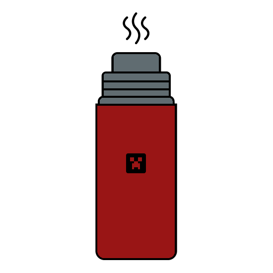

# Thorfusion's patched version of Thermos
Made for Terralization modpack

### Crashes?
Some modpacks might require patched versions of certain mods to work with this version of thermos

[Recurrent Complex](https://github.com/Thorfusion/RecurrentComplex)

[MobiusCore](https://github.com/Thorfusion/MobiusCoreTH)

## log4j2 status

| Original Server | Fixed | Comment                                                                                                         |
|-----------------|-------|-----------------------------------------------------------------------------------------------------------------|
| Forge           | :x:   | servers crashes on several codes, tries to run the code but it has an incorrect log4j setup causing it to crash |
| Spigot/Bukkit   | :x:   | run the codes and hangs                                                                                         |
| Thermos         | :x:   | run the codes and hangs                                                                                         |

| Thorfusion / maggi373 patched | Fixed              | Comment                   |
|-------------------------------|--------------------|---------------------------|
| Forge                         | :heavy_check_mark: | mitigated but not patched |
| Spigot/Bukkit                 | :x:                | bukkit not patched yet    |
| Thermos                       | :heavy_check_mark: | mitigated and patched     |

| CVE STATUS                        | Fixed              |
|-----------------------------------|--------------------|
| CVE-2021-45046                    | N/A                |
| CVE-2021-44228                    | :heavy_check_mark: |
| CVE-2021-4104                     | Should not work    |

---

### What's Thermos?
Thermos is a fork of KCauldron, a craftbukkit forge server for Minecraft 1.7.10. After periods of inactivity on KCauldron's GitLab concerning major issues, Thermos was created to allow active members of the Minecraft coding community to optimize it and provide fixes in a timely manner.

We hope to eliminate all issues with craftbukkit forge servers. In the end, we envision a seamless, low lag Thermos experience.

Advantages over KCauldron:
+ Lag-lowering optimizations
+ Better world protection (Forge stuff doesn't bypass Bukkit plugins!)
+ Many patches that KCauldron didn't get from Spigot
+ Dupe glitch fixes
+ Log4j patch

## Build Requirements
* Java 8u292 JDK or higher
* `JAVA_HOME` defined on your OS

## Building Thorfusion/Thermos
* Checkout project
  * You can use IDE or clone from console:
  `git clone https://github.com/Thorfusion/Thermos.git`
* Setup
  * Auto: `setup.sh`
  * Manual:
  `git submodule update --init --recursive`
* Build
  * This process downloads minecraft and apply patches
  * If you have gradle integration in IDE - you can still use gui
  * Auto: `build.sh`
  * Manual:
  `./gradlew setupCauldron jar`

All builds will be in `build/distributions`
  
## Updating sources
* Update sources
  * `git pull origin master`
* Re apply patches & build binaries
  * `./gradlew clean setupCauldron jar`
